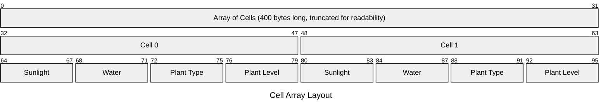

# Devlog Entry - 11/15/24
## Introducing the Team:
- Engine Co-Lead: Ethan Heffan  
- Engine Co-Lead: Arjun Krishnan  
- Design Co-Lead: Eric Wang  
- Tools Lead: Moore Macauley  
- Design Co-Lead: Igor Bessa  

## Tools and materials
1. We’re planning on using Godot. Most of our engine experience comes from Unity, so we’re hoping to broaden our game dev horizons by learning an up and coming engine that isn’t too dissimilar from what we already know. While we could have used Unreal, Arjun and Ethan have some, albeit limited experience in Godot, so we figured it would be our best bet.
2. Godot has a variety of languages, but we’ll probably stick with C# because we’re all already familiar through Unity, so it’ll be the easiest way to transition to an entirely new engine. We might end up having to encounter C++, GDScript, or Godot’s Visual Scripting language depending on the requirements. For data processing we plan to use JSON files. For instance, we might use JSON to define the initial state of the grid or how it updates. 
3. The main tools we’ll use are VSCode for our IDE which’ll let us access GitHub for version control. For making 2D assets, we’ll probably use Photoshop and Aseprite and whatever relevant free assets we find online. If we need to make any 3D assets, we plan to use Blender, and we plan to use the equivalent of Unity’s scene view in Godot to create our levels.
4. Our alternate platform choices are to swap our code from C# into C++ . Since Godot is compatible with both of these programming languages, and we all have some experience with C++ through our CSE classes, we hope to have a relatively seamless swap between the two languages.
## Outlook
1. Our team is hoping to become more proficient at using Godot. We felt that with Unity’s recent actions only knowing Unity is probably not our best move, so we wanted to pick up a different engine. 
2. The hardest part will be learning how to use Godot since none of us have much experience. 
3. We are hoping to learn Godot and gain experience utilizing several Game Development Patterns to streamline the coordination process. We are also hoping to practice using GitHub in a group setting for collaboration. 

# Devlog Entry - 11/22/24
## How we satisfied the software requirements
The first step to starting the project was figuring out how to make the project in the first place. Godot has two versions: the regular and .NET versions, so we went with .NET that has C# support. Next, Godot has a native IDE that lacks useful features like code suggestions, so we figured out a way to link Godot to VSCode through several VSCode plugins. As part of that, we had to write a few .json files with one containing a directory to our local Godot.exe file, meaning we had to figure out how .gitignores work to ensure we didn't overwrite each others .json files.

Now for the project requirements itself... we created a player character that can move around a 5x5 grid with WASD. The player has an inventory of 3 seed types and can plant/harvest of the cell it's standing on. We accomplish this grid management with several layers of abstraction starting at a Grid Manager that handles requests from the player input and informs each cell when their info must be updated and re-rendered. The Grid Manager will contact a Grid class that holds an array of Cell structs containing each cell's water level, sun level, plant level, and plant type. The Grid is responsible for performing all operations and checks on each cell using each plant type's unique growth requirements. 

The game is simple. The player starts with a set number of seeds of all 3 types. They can plant seeds with the 1-3 keys respectively and harvest with Space. A plant can be harvested only when it reaches level 3 and each plant type has unique requirements for leveling up. The player must harvest 3 plants of each type to satisfy the win condition. When the player hits the PROGRESS TIME button, the Grid Manager tells the Grid to iterate through every cell and increases the water level randomly and chooses a random sun level. If a cell has a plant, it also checks whether the plant should level up based on its water/sun levels and its current neighboring cells. The GridManager then tells each cell's renderer to update to the current information.

## Reflection
Our team's plan didn't change too, too much from the original. The concept of a Design lead was interesting because we all had pretty much equal involvement with the design, especially considering most of the design was figured out already with the software requirements. It'll surely change as we get further into the project, so we'll see how the Design Lead role works later. As for the Tools and Engine roles, Moore and Ethan figured out a lot of foundation for how the project would be set up, while Arjun, Igor, and Eric implemented a lot of features on top of the existing foundation. Tools and Engine Lead didn't feel very appropriate for describing any of our duties, in fact our roles felt most similar to front-end and back-end developers. We imagine this division of labor will likely continue as the code foundation must be expanded and new features must be implemented. 

Our tools/engines have not changed at all really. We used C# in Godot with VSCode as the IDE and will still try to swap to C++ if it seems like it'll be a smooth transition.

# Devlog Entry - 11/27/24
## How we satisfied the software requirements
### F0 Requirements
The F0 requirements were satisfied in the same ways as our last devlog. Players can move a character on a 5x5 grid using the WASD keys. Players start with a set number of each type of seed and can reap/slow on the grid cell they are standing on. Players can progress time by clicking a button, changing each cell's water and sun levels. Each plant on a grid cell is unique and grows based on rules specific to that plant type. The win condition is still harvesting 3 of each kind of plant. 

### F1 Requirements
- F1.A: For F1.A, we ultimately used an array of structs to represent the board state. In our GridManager script, we have the struct Cell, which contains 4 integers. They represent the level of sun in the cell, the amount of water in the cell, the plant type (if any) currently growing in that cell, and finally the maturity of the plant in the cell. We then have an array of these structs, which represents the board at any point in the game. As in C\#, structs and arrays are arrayed contigiously in memory (assuming neither contains any pointers, which ours do not), this ultimately creates one contigious byte array in memory. An image illustrating this approach can be seen below.

- F1.B: We satisfied this requirement by adding save and load buttons to the game scene. When clicked, players can choose between three save files to write their save to. After saving, players can use the load button to go back to that save file, reverting their changes no matter how much progress they have made since then. This also allows players to easily swap between save files at any point in their gameplay.
- F1.C: This requirement was satisfied with the addition of an autosave function to the ActionTracker class. The autosave function is called after any major action taken by a player (progressing time, planting a seed, or harvesting), and provides players with a safety net in case their game crashes before they can save. Players cannot manually overwrite the autosave save file, to stop them from unintentonally destroying their progress. When players start the game, they are prompted to either start a new game or load previously saved data (either from an autosave or from a player-chosen save file).
- F1.D: Players are presented with undo and redo buttons, which allow them to undo or redo any major action (progressing time, planting a seed, or harvesting). Players can undo indefinitely (until the start of gameplay), even from loaded save files. Players can also redo as many undos as are present in the stack, allowing them to redo anything they may have un-done on accident (even if they saved after undoing).

## Reflection 
As the project has progressed, we have found that many of our design choices are emergent from the requirements present in the assignments. As a result, we have continued to feel that our original role descriptions were not as accurate as they should be. Ethan and Moore continued to work on lower-level functionality that worked closely with engine-specific tools and functions, while Arjun, Igor, and Eric continued to build off of this foundation. For example, after the ActionTracker class was built to make the undo/redo system possible, Igor, Eric, and Arjun utilized that foundation to implement the multiple save file and autosave functionality. We all continued to work closely together in terms of design, allowing us all to offer input regarding specific implementation choices (like how exactly we would track major player actions and when those would be stored). We did choose to add a title screen to our game that allows players to view a quick tutorial that explains controls and the goal of the game, which gives players more clarity regarding their goals and what the gameplay entails.  
  
We did, however, make one signifgant design change for F2. At the professor's recommendation after looking at our early plan, we tried to get Godot to work with C++ before moving on. To our displeasure, we discoved that C++ was far harder to integrate with Godot than we first anticipated. Because of this, we ultimately decided to swap to GDScript instead, a scripting language made for Godot, instead of C++. Arjun and Ethan both investigated GDScript, as our group members most familiar with Godot, and found it quite similar to Python and easy to learn. While everyone else has no experiance with GDScript, we believe that the extra difficultly involved with learning it will ultimately be less than that of trying to get C++ working with Godot on everyone's computers, especially as we failed to get it working on even one. 

# Devlog Entry 12/4/2024  
## How we satisfied the software requirements
### F0+F1
The strategies behind our implementions F0 and F1 has gone unchanged, but we did make a few minor adjustments. We did have to change how the array of cells was stored - GDScript doesn't have structs that store their data contiguously like C sharp. So, instead, we store a PackedInt32Array which is an array of contiguous 32 bit ints. Each cell is reprsented by 4 ints in a row, where index 0 is the water level, 1 the sun level, 2 the plant type, and 3 the growth level. Ultimately, it is still an array of structs, but it is stored slightly different due to GDScript being a higher level language. We have, however, made some minor code quality adjustments as we worked on translating the code to a different language. For example, what, exactly, should be calling ActionManager functions was unclear, which resulted in several identical saved being made on occasion. We moved all of that into GridManager's do and undo function, as it is our controller, so that made the most sense.  
### External DSL for Scenario Design
For our external DSL, we used JSON, as gdscript has a parser for JSON. Two objects are read in by the program, "events" and "game settings". The "events" object will consist of an array of objects, each of which must contain at least a "time" int and a "type" string. The time will define the time step on which the event will start, and the type string defines which event will start at that time. The "game settings" object will contain a number of keys that define the starting values of various parameters. Below, you can see on potential configuration that could be used.
```
{
    "events": [
        { 
            "time": 2,
            "type": "drought"
        },
        {
            "time": 4,
            "type": "rainstorm"
        },
        {
            "time": 5,
            "type": "normal"
        }
    ],
    
    "game settings": {
        "min plants": 3,
        "minSunlight": 1,
        "maxSunlight": 10,
        "minWater": 3,
        "maxWater": 7,
        "gridSize": 5
    }
}
```
First, the events. This array would mean that conditions start normally, but at time step 2, a drought would begin, which reduces the amount of water growth and increaces the amount of sun every cell gets every timestep. This continues until time step 4, at which point a rainstorm starts, which lowers the maximum level of sun a tile can recieve, but increaces the amount of water the cells get per time step. Finally, at time step 5, the conditions return to normal, which reverts all the rates of change back to their defaults.  
Then, game settings. With this configuration, the player will need to harvest 3 plants of each type to win. Every tile will, on each time step, have at least 1 sunlight but no more than 10, and will gain at least 3 water, but no more than 7. Finally, the game will take place on a 5x5 grid. 
### Internal DSL for Plants and Growth Conditions
For our internal DSL, we implemented an array of dictionaries in GDScript, which is Godot's custom scripting language. It works by containing a number of parameters about when the plant can grow and a list of functions. When the grid checks if a plant can grow, it calls all of those functions with data about the cell in a dictionary, which all return a boolean based on if the plant currently meets the defined requirements to grow. If all of them return true, the plant will grow, otherwise nothing happens. You can see two plants' implemntations below.
```
[{
		"plantName": "Lily", 
		"waterRequirement": 2, 
		"sunRequirement": 8, 
		"maxGrowthLevel": 3, 
		"minAdjPlants": 0, 
		"maxAdjPlants": 4, 
		"startSeeds": 3,
		"specialCheck": [Callable(check_condition_requirements), Callable(special_lilly_check), Callable(check_neighbor_requirements)]
},  
{
		"plantName": "Rafflesia",
		"waterRequirement": 2,
		"sunRequirement": 2,
		"maxGrowthLevel": 3,
		"minLikePlants": 4,
		"maxLikePlants": 10,
		"minAdjPlants": 4, 
		"maxAdjPlants": 10, 
		"startSeeds": 8,
		"specialCheck": [Callable(check_condition_requirements), Callable(check_neighbor_requirements)]
}]  
```
In natural language, we have two plants, Lilies and Rafflesia. Lilies require 2 water and 8 sun to grow, and can be harvested once they reach growth level 3. They can have, at most, 4 plants adjacent to them if they are to grow, otherwise they don't get enough nutrients and can't. When their growth is checked, we check for the correct enviromental conditions, a special specific lilly check, and the number of neighbors they have. Rafflesia, on the other hand, can grow with only two water and 2 sun, and it must be adjacent to at least 4 other Rafflesia in order to be able to grow. It can be harvested when it reaches a growth level of 10. When we check its growth, we check for the correct eviroment and then that it has the right number of neighbors to be able to grow.  
### Switch to Alternate Platform
Finally, like we mentioned in the previous devlog, we swapped from C Sharp to GDScript. As previously mentioned, we had to rework the array of structs we were using to not actually include any structs, and instead be a long array with clumps of ints. We also had to decouple Grid from the GridManager more, as we could no longer represent them within the same file. This probably improved our overall code quality, as Grid was a bit more intertwined with GridManager than it probably should have been. Asides from that, most things stayed the same. Godot actually suports having scripts of both types similtaniously, so for most of the scripts all we did was ask Github Copilot to translate the file, then test it. We had to make a few changes here and there before testing, due to there being some workarounds nessisary for the staticly typed C Sharp to work together with the dynamically typed GDScript, but being able to test as we went made the translation much more managable.  
## Reflection
We really, *really* dogded a bullet swapping to GDScript instead of C++. Despite being a completely new language, GDScript was close enough to python that no one really had any difficultly learning it. The team behind Godot put a load of work making GDScript and C Sharp scripts work together, which as discussed, made our life much easier when we were translating it over. And while this wasn't really realivant for F2, for F3 Godot's mobile module only supports GDScript. It doesn't have the Unity feature where you can compile it into java for mobile, anything execpt GDScript simply doesn't work. We are similarly lucky we decided to go from C Sharp to GDScript instead of the other way aroud, as I'm not sure what we would have done if we discoved that we had to swap platform *again*.   
We do plan to make shuffle the roles a little bit into F3. Ethan has experiance with mobile builds, so we plan to designate him as the person in charge of our mobile builds. Asides from that, we plan to stick to the plan we've made.

# Usage Notes
Shovel Image from https://pixabay.com/vectors/sand-shovel-tool-158804/ 
Plant image by freepik https://pixabay.com/vectors/sand-shovel-tool-158804/
Undo image by freepik https://www.freepik.com/icon/undo_7456081 
Redo image by freepik https://www.freepik.com/icon/redo_7456086#fromView=resource_detail&position=95 
American flag from https://commons.wikimedia.org/wiki/File:Flag_of_the_United_States.svg 
Brazil flag from https://en.wikipedia.org/wiki/File:Flag_of_Brazil.svg 
Israeli flag from https://commons.wikimedia.org/wiki/File:Flag_of_Brazil_%281960%E2%80%931968%29.svg 
Chinese flag from https://commons.wikimedia.org/wiki/File:Flag_of_the_People%27s_Republic_of_China.svg 